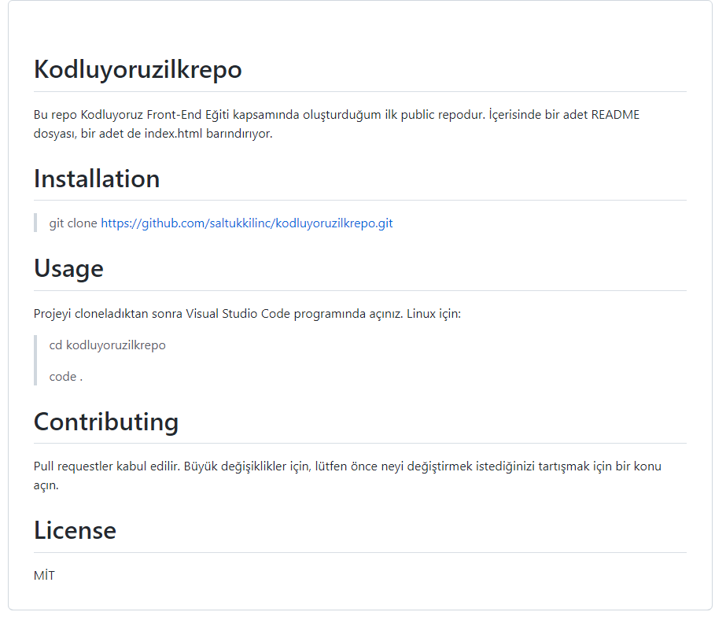

# Kodluyoruzilkrepo

Bu repo Kodluyoruz Front-End Eğiti kapsamında oluşturduğum ilk public repodur. İçerisinde bir adet README dosyası, bir adet de index.html barındırıyor.
# Installation
> git clone https://github.com/saltukkilinc/kodluyoruzilkrepo.git
# Usage
Projeyi cloneladıktan sonra Visual Studio Code programında açınız.
Linux için:

> cd kodluyoruzilkrepo
>
>code . 

# Contributing
Pull requestler kabul edilir. Büyük değişiklikler için, lütfen önce neyi değiştirmek istediğinizi tartışmak için bir konu açın.
# License
MİT

[patika](https://www.patika.dev/tr)
